# Milestone 01: Nice Can

**Snapshot date:** 2026-08-25  
**Authors' baseline:** commit `dde31ca` (`kyuminKIM00`, last upstream commit before the local work)  
**Committed local baseline:** `899b477` (`Input Square Crop`)  
**Scope:** committed environment/calibration/preprocessing work plus the current, not-yet-committed RotGS training changes

## Executive summary

This milestone took RotGS from successfully training the authors' `chair_45` sequence to producing a recognizable, comparatively sharp 360-degree reconstruction of a real Quöllfrisch can captured by an Orbitvu turntable.

The work had two distinct halves:

1. Build a reliable path from high-resolution turntable JPEGs to a RotGS-compatible dataset: deterministic angle ordering, square ROI selection, actual alpha segmentation, resizing, and mathematically correct camera intrinsics.
2. Adapt the authors' training assumptions to a fixed-camera, texture-dominated, nearly rotationally symmetric product: correct off-center projection, nonzero Gaussian position learning, a plausible learned axis and center, controlled angle corrections, alpha-aware losses, better diagnostics, and reproducible checkpoint/render behavior.

The first square-input run produced a visible but heavily averaged can. The final configuration improved the held-out metrics from `22.10 dB / 0.790 SSIM / 0.238 LPIPS` to `28.87 dB / 0.918 SSIM / 0.108 LPIPS`. The biggest single experimental discovery was that the internal rotation sign required by this dataset is `--rotation_direction 1`, even though the physical turntable sequence was described as clockwise. The second major discovery was that optical-flow supervision hurt this texture-dominated sequence; the best run uses `--wo_flow`.

The current result is the best can produced so far. Its large label and product geometry are learned well; very small printed text is still resolution-limited by the current 540×540 preprocessing.

## Result at a glance

| Model | Iteration | Gaussians | PSNR ↑ | SSIM ↑ | LPIPS ↓ | Interpretation |
|---|---:|---:|---:|---:|---:|---|
| Authors' `chair_45_full` | 30,000 | 60,131 | 33.282 | 0.9700 | 0.0402 | Reference quality, but a different and easier dataset |
| First square can run | 30,000 | 51,874 | 22.099 | 0.7903 | 0.2378 | Product visible, texture strongly averaged |
| Constrained alpha + flow run | 30,000 | 68,301 | 20.473 | 0.7501 | 0.2894 | More capacity did not help; the result degraded |
| Correct center/XYZ, no flow, sign `+1` | 10,000 | 21,363 | 25.919 | 0.8583 | 0.1622 | Decisive quality jump |
| Same model continued from 10k | 15,000 | 21,363 | 27.680 | 0.8964 | 0.1289 | Continued refinement without new Gaussians |
| Same model continued from 10k | 20,000 | 21,363 | 28.434 | 0.9104 | 0.1174 | Still improving |
| Same model continued from 10k | 25,000 | 21,363 | 28.818 | 0.9157 | 0.1110 | Near plateau |
| **Current best can** | **30,000** | **21,363** | **28.866** | **0.9179** | **0.1078** | Best geometry and label readability so far |

The metrics above are the standard held-out render metrics stored in each run's `results.json`. They are useful for comparing can experiments using the same split. The chair number is contextual rather than a controlled apples-to-apples comparison.

### Visual progression

The images below are existing artifacts from the dataset and saved render folders; the report does not contain regenerated or retouched examples.

| Prepared RGBA input | First square run, 30k |
|---|---|
| 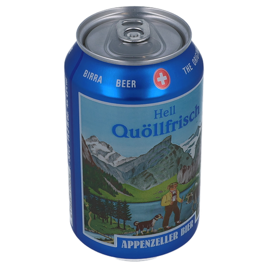 | 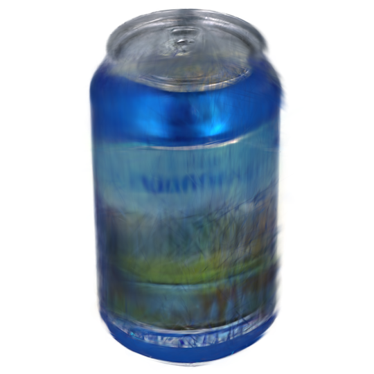 |

| Corrected model, 10k | Current best, 30k |
|---|---|
| 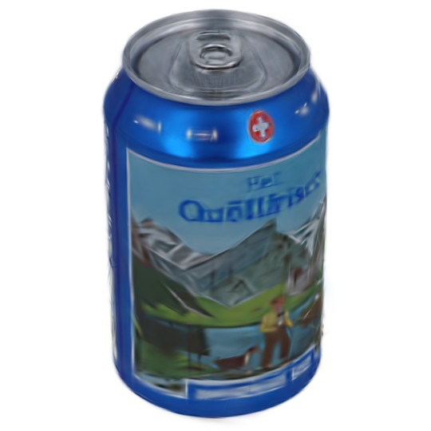 | 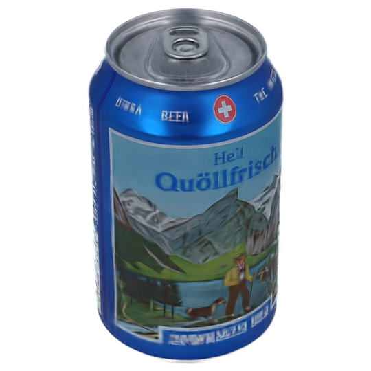 |

The progression shows why more iterations alone were not the first answer. The initial model had already converged to an angle-averaged texture. Once pose convention, center initialization, and XYZ learning were corrected—and flow was removed—the same 540×540 data could support much more coherent lettering.

### Failure modes that motivated the core changes

The saved intermediate renders make the debugging path more concrete. These are all the same held-out view (`00000`) where possible, so differences are mainly caused by the training configuration rather than viewpoint.

| First square model at 7k: an averaged cylinder | Exact-angle run at 15k: axis escaped toward x |
|---|---|
| 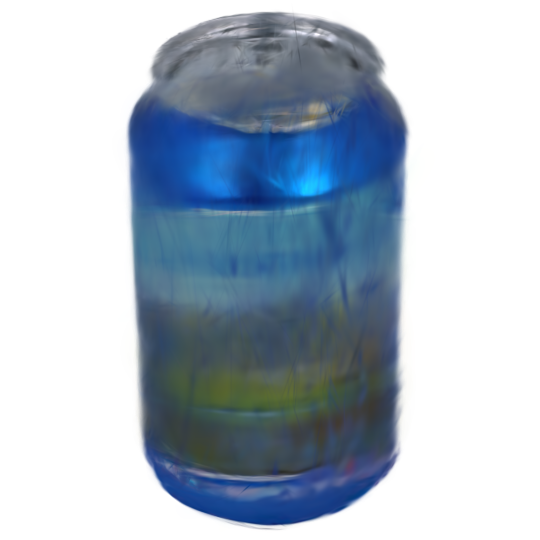 | 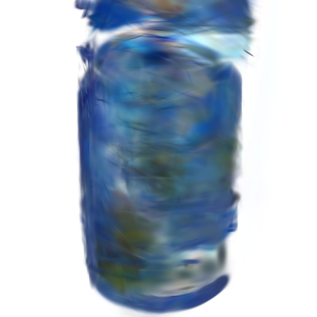 |

The 7k baseline had found the coarse can silhouette, but it averaged many angular textures into one translucent label. In the exact-angle experiment on the right, the unconstrained learned axis became proportional to `[2.987, 0.435, -0.322]`, or approximately `[0.984, 0.143, -0.106]` after normalization. It therefore rotated almost around the camera x-axis. The displaced top and twisted texture are the visible consequence. This result directly motivated initializing the axis near the physical expectation and constraining its tilt and sideways component without freezing it completely.

| Fixed y-axis but freely learned center at 7k | Bounded axis/center with flow at 30k |
|---|---|
| 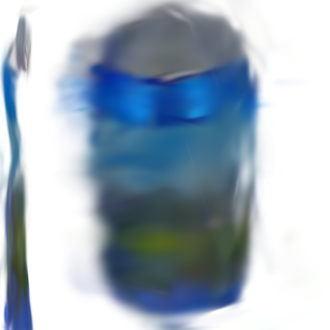 | 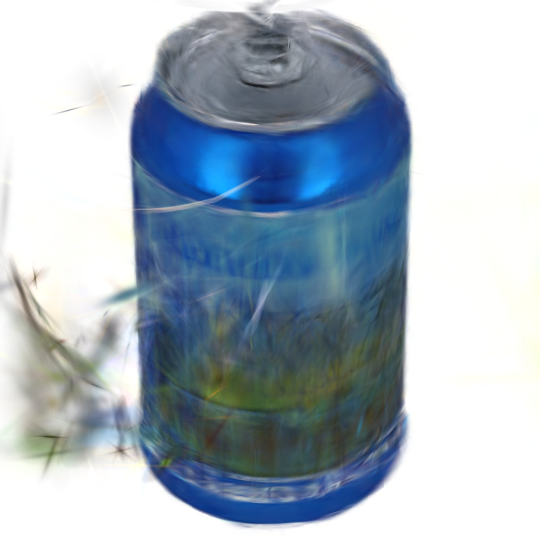 |

Fixing the axis alone did not solve motion: the freely learned center moved the rotational orbit away from the product, creating a second thin can-like fragment at the left. The later bounded model kept the product together, but strong optical-flow supervision still produced wispy background Gaussians and an angle-averaged label even after 30k. This comparison motivated alpha-centroid center initialization, center warm-up/regularization, and the controlled no-flow experiment.

| Correct center/XYZ but no densification | Correct center/XYZ and no flow, wrong sign `-1` |
|---|---|
| 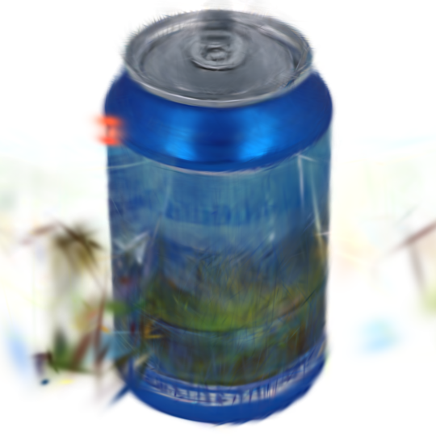 | 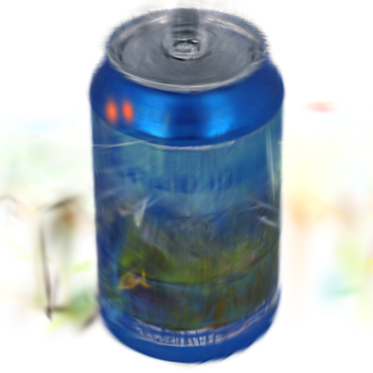 |

The left result demonstrates that real XYZ learning was necessary but did not eliminate the need for early densification. The right result removed flow and used the improved center and XYZ scale, yet retained sign `-1`; it still averaged the label and left orbiting artifacts. Changing only the internal sign to `+1` produced the sharp 25.92 dB 10k result shown earlier.

## Current end-to-end system

```text
High-resolution JPEG turntable sequence + calibrated session cameras.txt
                                |
                                v
      Detect 0, 5, ... angle token and sort views deterministically
                                |
                                v
        User selects a product bounding box on the first photograph
                                |
                                v
    Expand to the smallest source-pixel square containing the whole box
           (no stretching, no padding, no product clipping)
                                |
                                v
   Segment the product independently in every frame and create RGBA PNGs
                                |
                                v
     Resize crop to 540x540 and transform fx, fy, cx, cy for crop+scale
                                |
                                v
 <dataset>_cpy_rn_roi_sqr_PNGa/{images/*.png,sparse/0/cameras.txt,metadata}
                                |
                                v
 RotGS: exact angles, empirical sign +1, bounded learned axis/center,
        alpha-aware image loss, nonzero XYZ learning, no optical flow
                                |
                                v
      Densify through 5k, refine the fixed 21,363 Gaussians through 30k
```

## Environment and repository setup changes

### Reproducible `uv` environment

The project now has:

- `.python-version` pinned to Python `3.10.21`.
- `pyproject.toml` with the complete Python dependency set.
- `uv.lock` for reproducible resolution.
- PyTorch `2.8.0` and torchvision `0.23.0` from the CUDA 12.8 index, suitable for the RTX 5080 setup.
- Local path builds for `diff-gaussian-rasterization` and `simple-knn`, including their extra build dependencies.

This replaced ad-hoc environment setup with commands such as `uv sync` and `uv run python train.py ...`. The generated `egg-info/PKG-INFO` changes are local build metadata, not algorithmic RotGS changes.

### Dataset skeleton and ignore rules

COLMAP `sparse/0` and `sparse_colmap/0` text skeletons were added for the downloaded/reference datasets so their expected structure is present locally. `.gitignore` was extended to omit large or generated `*.png`, `*.ply`, `*.db`, and `*.ini` artifacts while retaining useful directory and text metadata.

For SIBR, a trained output must also be recognizable as a dataset/model. During this milestone, compatible `cameras.json` and `input.ply` files were supplied to the successful output folders when the viewer could not infer the dataset type from the custom RotGS layout. This is currently an operational compatibility step rather than an automatic exporter.

## Camera calibration utility

### `tools/calibration/get_camera_intrinsics.py`

This new utility calibrates the fixed session camera from a ChArUco image folder.

It:

- Searches PNG/JPEG calibration images.
- Tests several ArUco `5x5` dictionaries and ranks them by detections.
- Builds the configured 9×12 ChArUco board with 30 mm squares and 22 mm markers.
- Rejects unreadable, wrong-resolution, or low-corner-count frames.
- Requires at least five accepted images and recommends 20–40 varied views.
- Runs ChArUco/OpenCV camera calibration.
- Prints `fx`, `fy`, `cx`, `cy`, distortion coefficients, and RMS reprojection error.
- Saves the full result as `camera_calibration.npz`.
- Writes a RotGS/COLMAP-compatible `PINHOLE` `cameras.txt` beside the calibration folder.

The Quöllfrisch session calibration used in this milestone was:

```text
1 PINHOLE 6751 4501
  fx=5905.3025564984628
  fy=5909.2817964572741
  cx=3392.925112718543
  cy=2228.0167742226413
```

The motivation was to stop borrowing intrinsics from `chair_45`. Intrinsics determine the camera rays used for every pixel; wrong values do not directly crop the source image, but they make the optimizer explain observations using the wrong projection geometry and can blur, stretch, or misplace the learned scene.

## Preprocessing utilities added

All utilities preserve their source images and write sibling output folders. The substantial utilities use validation, progress bars, summaries, and temporary files to avoid leaving partially written final files.

### `jpg_to_png_folder.py`

Primary reusable function:

```python
jpg_to_png_folder(folder_name, rename_for_training=True, convert_to_rgba=True)
```

What it added:

- Processes direct-child `.jpg` and `.jpeg` files only.
- Extracts a trailing angle, including names ending in `_360_fake`.
- Sorts by angle and names outputs `0000.png`, `0001.png`, and so on by default.
- Writes to `<input>_PNGa` for RGBA or `<input>_PNG` for legacy PNG conversion.
- Preserves pixel dimensions and validates every saved image.
- Refuses filename collisions and verifies existing outputs before skipping.
- Reports file counts, failures, resolutions, byte sizes, and color-mode conversions.

Why it was added: the raw Orbitvu naming included both a sequence index and an angle, while RotGS relies on lexicographic image order. Deterministic zero-padded names eliminate ambiguity.

Important limitation discovered later: JPEG has no transparency. Converting JPEG to RGBA creates an alpha channel of 255 everywhere; it satisfies the file mode requirement but is **not a product mask**. This utility remains useful for conversion and naming, but `prepare_rotgs_sequence.py` is the correct route when a meaningful alpha mask is required.

### `remove_side_artifacts.py`

Primary reusable functions:

```python
calculate_side_cutoffs(width, left_percent, right_percent)
remove_side_artifacts(image, left_percent, right_percent)
process_folder(folder_name, left_percent, right_percent)
```

What it added:

- Validates `0 <= left < 100`, `0 <= right < 100`, and `left + right < 100`.
- Replaces the requested left and right fractions with pure white without cropping or resizing.
- Supports JPEG and PNG and preserves RGB/RGBA mode and dimensions.
- Writes `<input>_side_cropped` while preserving filenames.
- Reports representative pixel cutoffs and per-file failures.

Why it was added: early raw captures contained turntable/session artifacts outside the centered product. White replacement was a quick, non-destructive way to prevent those regions from becoming reconstruction targets.

For RGBA inputs, the inserted white pixels are opaque white. This utility predates the proper segmentation pipeline and is not a substitute for setting the background alpha to zero.

### `interactive_crop_folder.py`

Primary reusable functions:

```python
fit_selection_to_aspect(selection, image_size)
crop_image(image, crop_box)
update_camera_intrinsics(cameras_text, source_size, crop_box)
select_crop_box(...)
crop_png_folder(folder_name, cameras_file, ...)
```

What it added:

- Opens the first PNG and lets the user position/resize a product bounding box.
- Expands the box to the original image aspect ratio, ensuring consistent geometry across frames.
- Applies exactly the same crop to every PNG without modifying the sources.
- Preserves filenames and image modes.
- Updates focal lengths and principal point for the selected crop.
- Saves crop metadata and reports the transformation.

Why it was added: the product occupied too little of the full 6751×4501 capture. A shared crop increases effective foreground resolution, but cropping is only geometrically valid if the principal point is shifted by the crop origin.

### `downscale_images_for_flow.py`

Primary reusable functions:

```python
calculate_downscaled_size(width, height, max_width=1600)
downscale_image_for_flow(image, max_width=1600)
update_camera_intrinsics(cameras_text, output_size)
downscale_folder_for_flow(folder_name, cameras_file, max_width=1600)
```

What it added:

- Converts/retains RGBA and downsizes with Lanczos while preserving aspect ratio.
- Never upscales images already below the configured maximum width.
- Keeps filenames unchanged in `<input>_flow_ready`.
- Requires all outputs to have one common resolution for optical-flow batching.
- Scales `fx`, `fy`, `cx`, and `cy` independently for `PINHOLE`; also supports uniformly scaled `SIMPLE_PINHOLE`.
- Writes an updated `cameras.txt` and validates existing output images.

Why it was added: the optical-flow network could not practically process the original 6751-pixel-wide sequence. Resizing the RGBA image as a whole keeps RGB and alpha registered, while scaling intrinsics preserves the same camera rays.

This tool does not invent or repair alpha. It faithfully resamples whatever alpha channel it receives.

### `inspect_alpha_mask.py`

Primary reusable functions:

```python
find_alpha_pngs(folder_name)
inspect_alpha_mask(folder_name, display_max_width=1600,
                   display_max_height=900, start_index=0)
```

What it added:

- Validates that every viewed file is a PNG with transparency.
- Shows RGB on the left and a grayscale alpha visualization on the right.
- Supports Left/Up for the previous image, Right/Down for the next, with wraparound.
- Uses Escape to close and scales the window without modifying files.

Why it was added: file mode `RGBA` was repeatedly mistaken for “contains a useful mask.” This utility makes holes, opaque backgrounds, mask erosion, and frame-to-frame segmentation instability immediately visible.

### `prepare_rotgs_sequence.py`

Primary reusable functions include:

```python
detect_angle_order(...)
fit_selection_to_smallest_square(...)
crop_box_for_selection(...)
transform_camera_intrinsics(...)
select_product_box(...)
segment_product_alpha(...)
prepare_rotgs_sequence(...)
```

This is the integrated and recommended preprocessing path.

It performs the complete transformation:

1. Read direct-child JPEGs and detect which numeric filename token forms a complete `0, 5, 10, ... 355/360` sequence.
2. Sort by the detected physical angles and rename to zero-padded sequential PNG names.
3. Let the user draw a product bounding box on the first high-resolution image.
4. By default, expand it to the smallest in-image square containing the whole selection. It never stretches, pads, or clips the selected product.
5. Preview the first segmentation and let the user accept, reselect, or adjust the Lab threshold.
6. Segment every frame independently.
7. Combine cropped RGB and detected alpha into RGBA.
8. Resize to the selected width with Lanczos.
9. Transform the calibrated `PINHOLE` intrinsics for source scaling, crop translation, and final resizing.
10. Write the ready-to-train structure atomically and record a detailed `preprocessing_metadata.json` provenance file.

Default output structure:

```text
<input>_cpy_rn_roi_sqr_PNGa/
  images/
    0000.png
    0001.png
    ...
  sparse/
    0/
      cameras.txt
  preprocessing_metadata.json
```

The `--keep-source-aspect` switch retains the earlier source-aspect crop behavior and uses the older `_rn_roi_PNGa_ds` suffix.

#### Segmentation algorithm

The current segmentation is deliberately simple and controllable:

- Convert the working image to Lab color.
- Estimate background color as the median of a 2% border band.
- Compute per-pixel Lab distance from that background.
- Restrict possible foreground to the user-selected product area plus a small margin.
- Threshold the color distance.
- Apply morphological closing and opening.
- Keep the largest connected component.
- Fill enclosed holes.
- Reject implausibly tiny or huge foreground fractions.
- Resize the mask back with bilinear filtering, then resize the complete RGBA crop with Lanczos.

This works well for the can against the controlled studio background and produces a very stable nonzero-alpha fraction: mean `44.7966%`, range `44.6310%..45.0199%` over 73 frames.

It is not a general semantic segmentation model. Objects close to the background color, multiple disconnected product pieces, or severe reflections may need a different threshold or a future learned segmentation backend.

#### Exact crop and intrinsics used for the can

The recorded user selection was:

```text
source image: 6751 x 4501
product box:  (2870, 2510) .. (3886, 3956)
square crop:  (2655, 2510) .. (4101, 3956)
crop size:    1446 x 1446
output size:  540 x 540
```

For a crop `(left, top)` followed by scale `(sx, sy)`, the transformation is:

```text
fx' = fx * sx
fy' = fy * sy
cx' = (cx - left) * sx
cy' = (cy - top)  * sy
```

The resulting camera is:

```text
1 PINHOLE 540 540
  fx=2205.2997098956916
  fy=2206.7857331168243
  cx=275.57369354634386
  cy=-105.30493908698044
```

The negative `cy` is intentional, not a failed crop. It says that the calibrated optical center lies 105 output pixels above this tight lower-image crop. That discovery motivated the off-center projection change in RotGS; using only field of view would silently recenter the camera and invalidate the crop geometry.

### `debugging_tracking.md`

This note captured the first quantitative convergence analysis: checkpoint metrics, visibility/capacity observations, suspected angle drift, the fixed-camera zero-radius problem, and candidate next experiments. Some numbers in it describe the state of earlier outputs at the time of investigation; this milestone report supersedes it as the current consolidated account.

### Placeholder files

`tools/preprocessing/test.py`, `tools/calibration/test.py`, and `tools/dataset/test.py` are placeholders only. They do not currently provide automated coverage. This remains technical debt.

## Core RotGS training changes

The core working-tree diff currently touches 11 files with approximately 859 additions and 142 deletions relative to committed `HEAD`. These changes are described below by responsibility.

### `arguments/__init__.py`: explicit experiment controls

New model/training options expose formerly hard-coded assumptions:

- `angle_noise_std` and `rotation_direction`.
- `legacy_centered_projection` for comparison with the original centered-FoV projection.
- Separate axis and center learning rates.
- Foreground RGB, full-image RGB, alpha, and center-regularization weights.
- Foreground SSIM crop padding.
- Flow downsampling default changed from 4 to 2 to preserve more texture detail when flow is enabled.

The goal was to make every important hypothesis a command-line-controlled experiment instead of requiring source edits between runs.

### `scene/dataset_readers.py`: angle control, intrinsics, test split, and spatial scale

Changes:

- `CameraInfo` now carries `fx`, `fy`, `cx`, and `cy` explicitly.
- Fixed and multi-camera loaders accept synthetic angle-noise standard deviation and rotation direction.
- Direction follows the mathematical CLI convention: `+1` is counter-clockwise and `-1` is clockwise in the constructed angle array.
- Setting angle noise to zero produces exact evenly spaced angles instead of the authors' hard-coded Gaussian perturbation.
- The test-membership check now compares the image filename with the held-out filename list; the original comparison used a full path and could misclassify views.
- When all fixed-camera centers are identical, NeRF++ normalization returns radius zero. The loader now substitutes the known camera-to-object distance.

Why the spatial-scale change matters: Gaussian XYZ learning rates are multiplied by the scene radius. A radius of exactly zero froze every Gaussian position. Earlier models could only alter apparent geometry by densifying/splitting, changing scales and opacities, or removing points. The fix restores genuine position optimization.

### `utils/camera_utils.py`, `scene/cameras.py`, and `utils/graphics_utils.py`: alpha and off-center projection

Changes:

- RGBA alpha is preserved as a continuous 0–1 mask instead of immediately binarizing it.
- The mask is resized to the actual training resolution when necessary.
- Each camera records a foreground bounding box for cropped SSIM.
- RGBA RGB is still composited onto white for the photometric target, while alpha remains separately available for flow and loss weighting.
- The non-alpha fallback correctly converts the PIL image to grayscale instead of calling `.convert()` on a NumPy array.
- Intrinsics are scaled with any loader-level resize.
- Camera objects store full pinhole intrinsics.
- Projection can now use `fx`, `fy`, `cx`, `cy`, width, and height to build an off-center matrix.
- `camera_to_JSON` now uses the actual camera attributes and exports principal point values.

The original projection only used horizontal and vertical field of view, which assumes `cx = width/2` and `cy = height/2`. That is not valid after an asymmetric crop. The new projection preserves the calibrated ray of every pixel, including the can dataset's negative cropped `cy`.

### `scene/gaussian_model.py`: physically plausible motion and meaningful initialization

Changes:

- Separate `--freeze_axis` and `--freeze_center` controls; legacy `--wo_axis` still freezes both.
- Optional `bounded_tilt` axis parameterization.
- Axis initialization at a configurable camera tilt, 30° for these experiments.
- Configurable tilt range and sideways component limit. The can used tilt `0°..90°` and sideways tilt `±5°`.
- A bounded center offset using a smooth `tanh` parameterization.
- A center warm-up phase and separate axis/center learning schedules.
- Center-motion regularization.
- Rotation-center initialization from the mean alpha-mask centroid back-projected into the estimated object-depth plane, instead of blindly using the random point-cloud mean.
- Axis, center, and initial center are stored in checkpoints with legacy checkpoint compatibility.
- Saved point-cloud iterations now include `motion.json` as human-readable motion metadata.
- Loaded axis/center parameters honor their freeze settings.
- A malformed six-camera axis initializer in the released multi-camera branch was corrected.

The axis is not frozen in the best run. It starts near the expected physical direction and is allowed to optimize within plausible bounds. The center starts from image evidence, stays fixed for the first 2,000 iterations, and then moves only slightly under a bounded and regularized parameterization.

For the best run, motion evolved as follows:

| State | Axis tilt | Sideways tilt | Center shift |
|---|---:|---:|---:|
| Initialization | 30° | 0° | 0 |
| 10k | about 23.82° | about 0.28° | about 0.00467 |
| 30k | about 23.74° | about 0.27° | about 0.00469 |

This is a physically reasonable refinement, not an unconstrained axis escaping to explain the can's texture.

### `scene/residual_predictor.py`: controlled angle corrections

The authors' local residual-angle predictor could substantially alter nominal view angles. That is dangerous for a can whose geometry is nearly symmetric: the optimizer can average labels instead of finding the correct texture correspondence.

Changes:

- Optional smooth bound for local residual angles.
- A separate global sweep-error scalar per camera.
- The sweep correction accumulates linearly with normalized sequence time and is smoothly bounded, e.g. to `±4°`.
- One helper combines global sweep and optional local residual correction consistently.
- Residual plots include the learned sweep value.
- Weight loading supports an explicit iteration and remains compatible with older state dictionaries.

The best experiment disables local residuals with `--wo_tiny`, disables synthetic angle noise, and allows only the small bounded global sweep correction. At 10k it was approximately `-1.11°`; by 30k it relaxed to approximately `-0.05°`, suggesting the nominal 5° spacing was already good.

The current 73-view can sequence contains a copied 0° image as its 360° endpoint because the real 360° photograph was not captured. It is retained so the existing loader creates exact 5° spacing over 73 samples. Future sequences should include a real 360° endpoint. A future loader should consume explicit metadata angles and support a 72-image cyclic `0°..355°` sequence without requiring duplication.

### `utils/loss_utils.py` and `train.py`: alpha-aware optimization and diagnostics

New loss helpers:

```python
masked_l1_loss(output, target, mask)
masked_psnr(output, target, mask)
```

They normalize by foreground pixel count rather than full image area. This prevents a large, easy white background from diluting errors on labels and letters.

The current image objective is:

```text
image loss =
    (1 - lambda_dssim) * lambda_foreground_rgb * foreground-normalized L1
  + lambda_dssim * (1 - SSIM on padded foreground crop)
  + lambda_full_rgb * full-image L1
  + lambda_alpha * rendered-alpha versus input-alpha L1

total loss = image loss
           + lambda_flow * flow loss
           + lambda_center_reg * center-motion regularization
```

The smaller full-image term remains useful: it penalizes unwanted Gaussians or opacity in the known-empty background. Alpha loss gives a more direct silhouette/occupancy signal. The foreground terms concentrate most reconstruction pressure on the label and product body.

Other training changes:

- A shared angle helper keeps RGB and flow rendering consistent.
- The final training view now gets a cyclic successor instead of being skipped as a current view.
- Flow targets and masks are cached independently; the camera's original alpha mask is no longer overwritten by a flow-specific validity mask.
- Flow is only active in its configured early motion-learning window.
- Checkpoint resume uses `weights_only=False` for trusted local checkpoints, required by newer PyTorch behavior.
- Residual/sweep weights are saved alongside Gaussian checkpoints and reloaded at the matching iteration.
- The complete argument namespace is saved in `cfg_args`.
- Gaussian learning rates are updated before the current iteration's render/optimization.
- Startup prints spatial scale and initial XYZ learning rate.
- Progress output includes foreground loss, alpha loss, flow loss, tilt, sideways tilt, center shift, and sweep error.
- Evaluation prints full-image PSNR plus foreground PSNR/SSIM and current motion parameters.

Optical flow still uses RGB features—it is not silhouette-only. The flow network sees white-composited RGB pairs, then the alpha/validity mask restricts the supervised loss to relevant foreground pixels. That should theoretically exploit labels and letters. Empirically, on this symmetric reflective can at 540×540, the flow signal was noisy or convention-misaligned enough to hurt the result, so the current best run disables it.

### `render.py`: train/render consistency

Rendering now reconstructs the Gaussian model with the saved axis/center constraints, reconstructs the residual predictor with the saved bounds, applies the same combined angle correction as training, and loads residual weights for the exact loaded Gaussian iteration. CLI defaults are arranged so saved `cfg_args` values are not accidentally overwritten by render defaults.

This addressed a reproducibility problem where a model could train under one motion model and render under another.

## Chronological development and decision flow

This chapter records not just what changed, but why each result motivated the next intervention.

### Phase 1 — Establish the authors' reference and local runtime

The first step was making RotGS run reproducibly on the RTX 5080 using `uv`, Python 3.10, CUDA 12.8 PyTorch, and locally built rasterizers. `chair_45` was trained and displayed successfully in SIBR. That established that the runtime, renderer, and authors' general pipeline were functional.

**Evidence:** `chair_45_full` reached 33.28 dB PSNR and rendered a coherent chair.  
**Next question:** what assumptions of the authors' prepared square RGBA dataset were missing from the Orbitvu photographs?

### Phase 2 — Determine input requirements and deterministic ordering

The Orbitvu sequence contained 72 real views at 5° increments plus a copied 0° endpoint named as 360°. We established that lexicographic filenames must match angular order and added deterministic `0000.png..0072.png` naming. The first JPG-to-PNG tool added RGBA mode and `_PNGa` naming.

**Discovery:** RGBA mode alone is not an alpha mask; JPEG conversion produces alpha 255 everywhere.  
**Next step:** inspect the authors' chair alpha and build tooling to expose and preserve alpha explicitly.

### Phase 3 — Remove obvious artifacts, crop, downscale, and transform intrinsics

Side whitening, interactive crop, and flow-ready downscaling were added. Each operation preserved names/dimensions as appropriate and updated camera intrinsics when geometry changed.

Early resized input changed the calibrated camera from 6751×4501 to 540×360. A negative or off-image principal point initially looked suspicious, but the crop/scale equations showed it could be correct.

**Result:** training completed, but SIBR showed a white or meaningless scene. Flow eventually printed `0.0000`, partly because its early supervision schedule had ended, not necessarily because flow was absent at all times.  
**Next step:** inspect the actual alpha values at every preprocessing stage rather than relying on folder names.

### Phase 4 — Trace the lost mask and consolidate preprocessing

Inspection showed the raw JPGs had no alpha and every downstream `_PNGa` created by direct conversion was fully opaque. Raw formats did not provide a usable embedded product mask either. This explained why white background dominated and why the pipeline could not reliably distinguish object occupancy.

The individual tools were consolidated into `prepare_rotgs_sequence.py`: automatic angle-token detection, interactive ROI, per-frame segmentation, RGBA generation, downscaling, intrinsics transformation, final RotGS layout, and provenance metadata.

**Result:** meaningful, stable alpha masks across all 73 frames.  
**Next step:** address the mismatch between the rectangular can crops and the authors' square inputs.

### Phase 5 — Use the smallest square containing the selected product

The pipeline was changed so the user-selected product must remain entirely inside the output, while the crop expands only enough to become square. It uses real source pixels and adds neither stretching nor padding.

**Result:** the first square run was the first clearly successful can reconstruction. It reached 22.10 dB and looked much better than the white failures, but the label remained averaged and much worse than `chair_45`.  
**Next question:** was 30k too short, or had the model converged to the wrong motion/geometry?

### Phase 6 — Diagnose convergence instead of merely extending training

Checkpoint metrics showed the first square run moved only from 21.93 dB at 15k to 22.10 dB at 30k. More unchanged iterations were not enough. Inspection found several coupled issues:

- The learned local residual could alter the sweep too much.
- Synthetic angle noise was inappropriate when the turntable increments were already known.
- A cylinder provides weak geometric evidence for angle; its label texture must disambiguate views.
- Fixed-camera NeRF normalization set the spatial scale to zero, freezing XYZ movement.
- White-background loss underweighted the product.
- The learned axis and center needed physical priors without being completely frozen.

This motivated exact nominal angles, optional/bounded angle corrections, foreground/alpha losses, bounded axis/center controls, motion diagnostics, and the fixed-camera spatial-scale fix.

### Phase 7 — Controlled axis, center, flow, and residual experiments

A sequence of deliberately narrower runs compared:

- exact versus noisy angles;
- learned residuals versus `--wo_tiny`;
- fixed versus learned axis and center;
- flow versus no flow;
- both rotation signs;
- densification versus no further densification.

The constrained alpha+flow run produced many Gaussians—68,301 by 10k—but quality declined from 20.78 dB at 15k to 20.47 dB at 30k. During a related run, CUDA reported an illegal memory access shortly after 10k. The timing implicated densification as a possible trigger, but did not prove an out-of-memory condition. A hard Gaussian cap was therefore not added.

One unconstrained exact-angle run made the axis problem especially visible. Its saved axis normalized to approximately `[0.984, 0.143, -0.106]`: almost the x-axis instead of the expected mostly vertical/tilted turntable axis. The resulting render is included in the failure gallery above. Because a can is nearly symmetric in geometry, the optimizer could choose this incorrect axis while using blurred texture and stray Gaussians to reduce the aggregate image loss. This was the clearest evidence that “learn any arbitrary axis” was too permissive for the product sequence.

**Important lesson:** densification is necessary to add spatial capacity, but more Gaussians are not automatically better. Once an incorrect motion model has smeared texture, densification can represent the wrong explanation more densely.

### Phase 8 — Fix center initialization and real XYZ learning

The rotation center was initialized from the alpha centroid, and the fixed-camera scene scale was changed from zero to camera distance. This restored nonzero XYZ learning. Densification was kept early but bounded in time.

Intermediate comparisons:

| Experiment | 10k PSNR | Conclusion |
|---|---:|---|
| Center/XYZ with no further densification | 20.88 | Position learning alone was not the missing factor |
| Center/XYZ, no flow, sign `-1` | 21.26 | Removing flow helped slightly, but texture was still averaged |
| Center/XYZ, no flow, sign `+1` | **25.92** | Rotation convention was the decisive remaining issue |

Although the physical acquisition was described as clockwise, RotGS applies rotations in an active/passive transform convention where the empirically correct internal sign for this ordered image sequence is `+1`. The CLI retains the mathematical naming—`+1` counter-clockwise, `-1` clockwise—but the data-to-transform convention still needs future automatic verification.

### Phase 9 — Refine the correct 10k model to 30k

The successful 10k checkpoint was continued in a new 30k output folder. Densification remained stopped after 5k, so the Gaussian count stayed at 21,363. This did **not** mean the complete geometry was frozen: XYZ learning remained nonzero through its schedule, and scale, rotation, opacity, color/SH, axis, center, and sweep parameters could continue refining. Low-opacity or unhelpful Gaussians could also become effectively invisible without being physically deleted after densification ended.

The continuation improved steadily:

```text
10k -> 15k: +1.76 dB PSNR, LPIPS 0.1622 -> 0.1289
15k -> 20k: +0.75 dB PSNR, LPIPS 0.1289 -> 0.1174
20k -> 25k: +0.38 dB PSNR, LPIPS 0.1174 -> 0.1110
25k -> 30k: +0.05 dB PSNR, LPIPS 0.1110 -> 0.1078
```

#### Visible refinement after the corrected 10k checkpoint

| 15k | 20k | 25k |
|---|---|---|
| 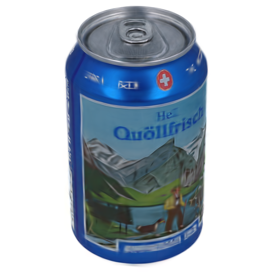 | 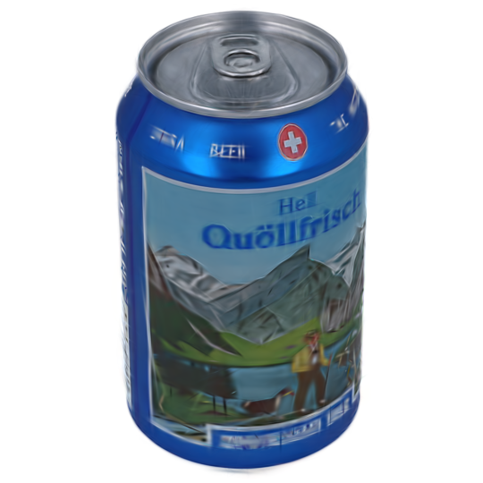 | 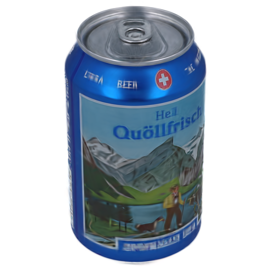 |

The later checkpoints no longer change the gross pose. They progressively reduce translucency and orbiting fragments, sharpen the top rim and pull tab, stabilize the Swiss emblem, and improve the large `Quöllfrisch` lettering. The visual gain from 25k to 30k is small, matching the metric plateau.

This is a healthy convergence curve with a clear plateau near 30k, unlike the first square run that plateaued around the wrong texture explanation.

## Reproducible best-run configuration

The successful 10k experiment used:

```powershell
uv run python train.py `
  -s "C:\Users\Thor\gitreps_SwissEP\RotGS\datasets\alphashot\session2\products\Quoellfrisch_02_top_cpy_rn_roi_sqr_PNGa" `
  --name "Quoellfrisch_02_top_center_xyz_noflow_ccw_10k" `
  --iterations 10000 `
  --axis_mode bounded_tilt `
  --axis_tilt_init_deg 30 `
  --axis_tilt_min_deg 0 `
  --axis_tilt_max_deg 90 `
  --axis_side_limit_deg 5 `
  --center_max_offset 0.25 `
  --center_warmup_iterations 2000 `
  --max_sweep_error_deg 4 `
  --angle_noise_std 0 `
  --rotation_direction 1 `
  --wo_tiny `
  --wo_flow `
  --flow_downsampling 2 `
  --densify_until_iter 5000 `
  --test_iterations 3000 5000 7000 10000 `
  --save_iterations 3000 5000 7000 10000 `
  --checkpoint_iterations 5000 10000
```

The 30k result was continued from that checkpoint in a separate output folder with tests/saves/checkpoints at 15k, 20k, 25k, and 30k. Separating the continuation preserved the known-good 10k model.

## What did not work, and what it taught us

| Attempt | Outcome | Lesson |
|---|---|---|
| JPEG→RGBA only | Fully opaque alpha | Color mode is not segmentation |
| Side whitening alone | Background still participates as opaque content | White removal is not an alpha mask |
| High-resolution flow input | Impractical memory/compute | Downscale RGB and alpha together and scale intrinsics |
| Rectangular/tight early datasets | White or weak reconstructions | Dataset framing and valid masks mattered greatly |
| Borrowed `chair_45` intrinsics | No principled improvement | Intrinsics must describe the actual calibrated and cropped camera |
| More iterations on wrong square baseline | Only +0.17 dB from 15k to 30k | Diagnose the plateau before extending training |
| Unbounded/local angle correction | Texture could be angle-averaged | Symmetric geometry needs strong angle priors |
| Constrained model with flow | 20.47 dB at 30k despite 68k Gaussians | More capacity cannot repair a harmful supervision signal |
| No densification | 20.88 dB at 10k | Densification is useful, but should be controlled |
| Corrected model, no flow, sign `-1` | 21.26 dB | Physical direction labels do not directly determine internal transform sign |
| Corrected model, no flow, sign `+1` | 25.92 dB at 10k | Empirical sign verification was essential |

## Current limitations and technical debt

1. **540×540 limits tiny text.** The source crop is 1446×1446, so the current pipeline discards roughly 62.7% of the linear crop resolution. More 540×540 iterations cannot recreate letters that were heavily downsampled.
2. **The best flow setting is currently off.** Flow remains implemented and alpha-aware, but it has not yet been made beneficial for this product.
3. **Rotation direction is empirical.** The current dataset needs flag `+1`; automatic sign selection is not implemented.
4. **The copied 360° endpoint is a workaround.** Future captures should include a real 360° image, and the loader should eventually accept explicit per-frame angles and cyclic 72-view data.
5. **Segmentation is studio-background based.** It is not a general object segmentation model.
6. **SIBR compatibility is partly manual.** Custom outputs may need `cameras.json` and `input.ply` supplied before the viewer recognizes them.
7. **Core training changes are not yet committed at this snapshot.** They exist in the current working tree on top of `899b477`.
8. **Automated tests are missing.** The current placeholder `test.py` files do not validate crop math, intrinsics, angle ordering, projection, checkpoint compatibility, or losses.
9. **No hard Gaussian cap was added.** The previous CUDA illegal-access failure was not proven to be caused by a specific count. A cap could prematurely stop the densification needed for small text.

## Recommended next milestone

The next controlled improvement should target input detail before adding another loss or substantially changing the motion model.

1. Re-run `prepare_rotgs_sequence.py` directly from the original 6751×4501 JPEGs with `--width 1080`, using the same physical ROI and segmentation logic. Do not upscale the existing 540×540 PNGs.
2. Write to a distinct dataset name so the 540 baseline remains reproducible.
3. Keep the known-good training controls: exact angles, internal direction `+1`, bounded learned axis and center, `±4°` global sweep, no local residual, and no flow.
4. Run to 10k first, densifying through 5k, with checkpoints at 3k/5k/7k/10k.
5. Do not impose a hard Gaussian cap on the first 1080 experiment. Monitor Gaussian count and GPU behavior. If the illegal access reproduces, first make densification gentler—for example interval 500 instead of 300 or threshold `0.0003` instead of `0.0002`—before adding a cap.
6. Compare foreground PSNR/SSIM, standard PSNR/SSIM/LPIPS, Gaussian count, label readability, and motion parameters against the 540 baseline.
7. Only after the higher-resolution baseline is stable, consider a small foreground edge/Sobel loss to put more pressure on letter boundaries.

The 540 run has already shown that the model and motion assumptions can learn this can. The remaining visible gap is now dominated by fine texture fidelity rather than “no meaningful reconstruction.” That is why this milestone is aptly the **nice can** milestone: the pipeline has crossed from debugging structural failure to optimizing quality.

## File inventory

### Substantive committed additions since the authors' baseline

- `.python-version`
- `pyproject.toml`
- `uv.lock`
- `tools/calibration/get_camera_intrinsics.py`
- `tools/preprocessing/jpg_to_png_folder.py`
- `tools/preprocessing/remove_side_artifacts.py`
- `tools/preprocessing/interactive_crop_folder.py`
- `tools/preprocessing/downscale_images_for_flow.py`
- `tools/preprocessing/prepare_rotgs_sequence.py`
- `tools/preprocessing/inspect_alpha_mask.py`
- `tools/preprocessing/debugging_tracking.md`
- session calibration and selected `cameras.txt`/preprocessing metadata
- reference dataset `sparse`/`sparse_colmap` text structure

### Current core RotGS working-tree changes

- `arguments/__init__.py`
- `render.py`
- `scene/__init__.py`
- `scene/cameras.py`
- `scene/dataset_readers.py`
- `scene/gaussian_model.py`
- `scene/residual_predictor.py`
- `train.py`
- `utils/camera_utils.py`
- `utils/graphics_utils.py`
- `utils/loss_utils.py`

### Principal milestone artifacts

- Dataset: `datasets/alphashot/session2/products/Quoellfrisch_02_top_cpy_rn_roi_sqr_PNGa`
- First square baseline: `output/Quoellfrisch_02_top_cpy_rn_roi_sqr_PNGa_full`
- Corrected 10k model: `output/Quoellfrisch_02_top_center_xyz_noflow_ccw_10k`
- Current best continuation: `output/Quoellfrisch_02_top_center_xyz_noflow_ccw_30k`
- Authors' reference: `output/chair_45_full`
